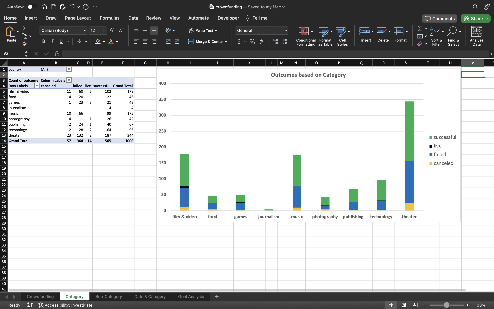

# Crowdfunding Success Analysis Project

## Background
Welcome to the Crowdfunding Success Analysis Project! In the past decade, crowdfunding platforms like Kickstarter and Indiegogo have revolutionized the way ideas get funded, enabling everyone from independent creators to famous celebrities to turn their visions into reality. The surge in popularity of these platforms has led to an incredibly diverse array of projects seeking funding, ranging from innovative tech products to unique artistic endeavors.

However, the path to crowdfunding success is not straightforward. While some projects soar past their funding goals, others struggle to gain traction. Understanding what contributes to a project's success or failure in such a dynamic and competitive environment is crucial, especially for organizations and individuals looking to launch their own crowdfunding campaigns.

This project focuses on dissecting and analyzing a database of 1,000 sample projects from these crowdfunding platforms. Our objective is to delve deep into this dataset to unearth hidden trends, patterns, and insights that can demystify the elements of successful crowdfunding campaigns. By meticulously organizing and scrutinizing various aspects of these projects — such as funding goals, campaign duration, project categories, and backer count — we aim to uncover potential strategies or commonalities that can be the key to success. Let's dive into the data and discover what it takes to turn a crowdfunding dream into a reality!
## Data
This project utilizes a specially curated dataset titled `CrowdfundingBook.xlsx`, provided by edX Boot Camps LLC. The dataset is designed for educational purposes, offering a unique opportunity to explore the dynamics of crowdfunding campaigns. A brief description of each column is provided in the table below: 
| Column Name             | Description |
|-------------------------|-------------|
| `id`                    | A unique identifier for each entry in the dataset. |
| `name`                  | The name of the project or entity associated with the crowdfunding campaign. |
| `blurb`                 | A brief description or summary of the project or campaign. |
| `goal`                  | The financial goal set for the crowdfunding campaign. |
| `pledged`               | The amount of money that has been pledged to the campaign. |
| `outcome`               | The status of the campaign, indicating whether it was successful, failed, etc. |
| `backers_count`         | The number of backers who have supported the campaign. |
| `country`               | The country where the campaign originated. |
| `currency`              | The type of currency in which the campaign's financial goal and pledges are denominated. |
| `launched_at`           | The timestamp for when the campaign was launched. |
| `deadline`              | The deadline or end date for the campaign. |
| `staff_pick`            | A Boolean value indicating whether the campaign was featured as a staff pick. |
| `spotlight`             | A Boolean value indicating whether the campaign was highlighted in a spotlight feature. |
| `category & sub-category` | The main category and sub-category classification of the campaign. |
## Data Preparation and Visualization 
For the first part of our analysis, we will apply conditional formatting to the `outcome` column. This process will visually differentiate each campaign based on its status - whether it's live, successful, failed, or canceled. Here's how to execute this:

1. **Selecting the Column**: First, select all of column F, where the campaign outcomes are listed.

2. **Accessing Conditional Formatting**: Navigate to the Home ribbon in Excel and click on `Conditional Formatting`. From there, choose `New Rule` and select the `Classic` style for the formatting.

3. **Creating Specific Rules**: We will set up four distinct rules under the `Format only cells that contain` option, each targeting `Specific Text` containing certain keywords. The rules are as follows:

	* **Live Campaigns**: Cells that contain the word `live` will be formatted with a light blue background and dark blue text. This color scheme is indicative of ongoing or active campaigns.

	* **Successful Campaigns**: For cells containing `successful`, a light green background with dark green text will be applied. This represents the accomplishment of the campaign goals.

	* **Failed Campaigns**: Cells marked `failed` will be highlighted with a light red background and dark red text. This coloring denotes that the campaign did not achieve its intended targets.

	* **Canceled Campaigns**: For campaigns labeled as `canceled`, a light yellow background with dark yellow text will be used. This highlights campaigns that have been discontinued or aborted.


Next we will create a new column called `Percent Funded` to the left of the outcome column that uses a formula to find out how much money a campaign made relative to its initial funding goal. The formula to be used is as follows:
```excel
=E2/D2*100
```
Ensure the column is formatted as a Number with no decimal places. Then we will use conditional formatting to fill each cell in the Percent Funded column according to a three-color scale. The scale should start at 0 with a dark shade of red, and it should transition to green at 100 and blue at 200. 


Now let's create a new column called `Average Donation` that uses a formula to find how much each project backer paid on average. The formula to be applied is as follows:
```excel
=E3/H3
```
Format the column as a Number with two decimal places and modify cell I1 to 0 to prevent errors in the formula, as division by zero is not permissible.


Then create two new columns, one called `Parent Category` and another called `Sub-Category`, that uses formulas to split the `Category and Sub-Category` column into the two new, separate columns. The formula for Parent Category is as follows: 
```excel 
=LEFT(P2,SEARCH("/",P2)-1)
```
For Sub-Category, use this formula: 
```excel
=RIGHT(P2,LEN(P2)-SEARCH("/",P2))
```


Now lets create a new worksheet named `Category` and insert a pivot table to analyze the initial worksheet. This pivot table will quantify the number of campaigns that were successful, failed, canceled, or are currently live, categorized by **category**. Begin by selecting any cell within the Crowdfunding worksheet, then navigate to the Insert tab and select Pivot Table. Add this pivot table to the `Category` worksheet. Subsequently, drag `Parent Category` to the rows, `outcome` to the columns and values section, and `country` to the filter section.


Then create a stacked-column pivot chart with a country filter, based on the table we have created. Begin by selecting any cell within the pivot table. Then, navigate to the `Insert` tab and select `PivotChart`. After inserting the chart, change the chart type to a stacked-column chart



Next, lets create a new worksheet titled `Sub-Category` with a pivot table that analyzes the initial worksheet to count how many campaigns were successful, failed, or canceled, or are currently live per **sub-category**. Insert a new Pivot Table on the Sub-Category worksheet and drag `Sub-category` to the rows, `outcome` to the columns and values section, and `country` and `Parent Category` to the filter section. 

![images/PivotTable2.png)